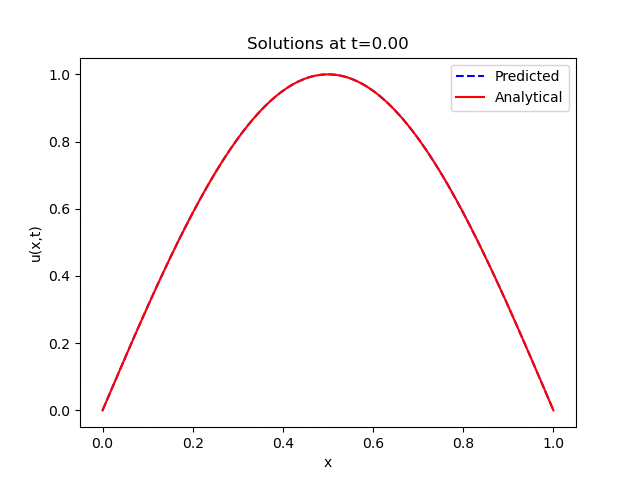

# Modelling the Diffusion of a One Dimensional Rod with Physics Informed Neural Networks

## Overview
This repository contains the implementation of a solution for the 1D diffusion equation using Physics-Informed Neural Networks (PINNs). It also includes a comparison of the results obtained from PINNs with those from the Forward Time Central Space (FTCS) method and an analytical solution. The primary goal is to explore the effectiveness of PINNs in solving differential equations and to compare their performance with traditional numerical methods.

### Animation of analytical solution along with the PINN prediction 



## Repository Structure

- `main.py`: The main script that orchestrates the execution of the project. It includes the initialization of models, training procedures, and comparison logic.

- `NN.py`: Contains the implementation of the Physics-Informed Neural Network. This file defines the neural network architecture and loss functions.

- `testing_explicit.py`: A script for testing the FTCS method. It includes the implementation of the FTCS algorithm and its application to the 1D diffusion equation.

- `utils.py`: A utility module that provides various helper functions and classes used across the project. This includes data preprocessing, analytical solutions, and other , and training procedures.

- `model_*.pt`: Pre-trained models saved in PyTorch's `.pt` format.


## Dependencies
To run the scripts in this repository, the following dependencies are required:
- Python 3.x
- PyTorch (for neural network implementation and training)
- Matplotlib (for plotting and visualizing results)
- NumPy (for numerical computations)
- Additional libraries may be required and can be found listed in a `requirements.txt` file.
- In order to install all the dependencies, simply create a conda environment by running

```
$ conda create --name <env> --file requirements.txt
```


## How to Run
- In order to install all the dependencies, simply create a conda environment by running

```
$ conda create --name <env> --file requirements.txt
```

- To run the code remove comments for the desired results in `main.py` and run. 
